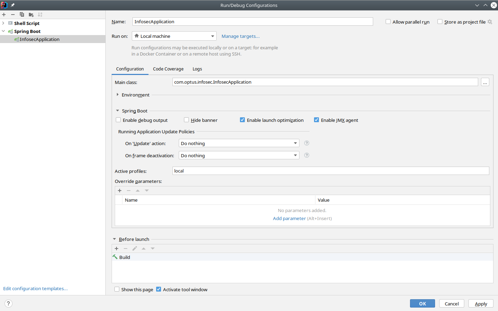

# SRA Infosec portal

#### Project JDK Version: 11

#### Installing portal-sdk jar locally (if you have build issues with for this specific dependency)
1. download jar from here -> https://drive.google.com/file/d/170WW0fiK9b-lV4OZe4HHKi08YayDica6/view?usp=sharing
2. install the jar using following command
```shell
mvn install:install-file -Dfile=<path-to-file> -DgroupId=au.com.optus.portal -DartifactId=portal-sdk -Dversion=1.9.6 -Dpackaging=jar -DgeneratePom=true
```

#### Running the project in local tomcat

1. Set the "active profile" in Run/Debug configurations as follows
2. Run the main method in "src/main/java/com/optus/infosec/InfosecApplication.java"



#### Running the project in wildfly server

1. Run the following command in terminal/cmd in the project root.

```shell
mvn clean install -P dev
```

2. copy the war file to deployments folder in your wildfly installation 
